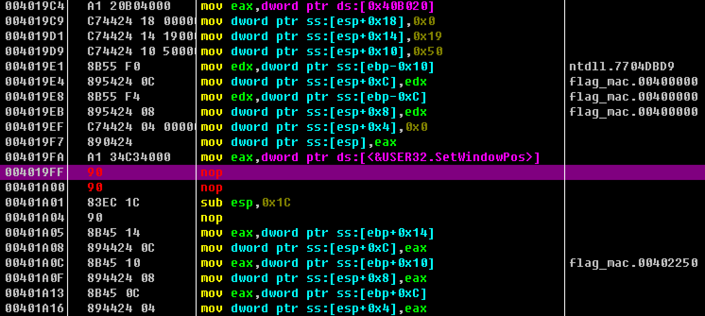
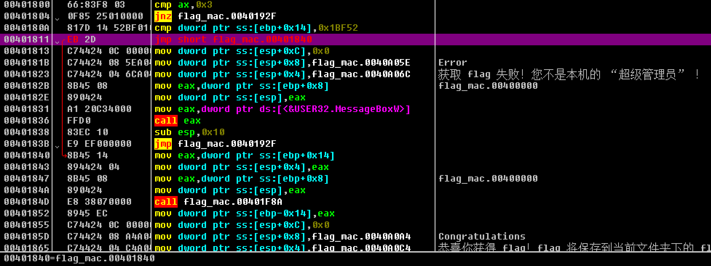

## Flag 自动机

修改两处代码即可，这里使用的是 Ollydbg。

第一处把 `call eax` nop 掉，使按钮不再乱飞：

第二处把跳转改为 `jmp` 无条件跳转，绕过「权限检测」：

然后就可以直接获得 Flag 了，解密什么的肯定不需要去关心的。

其实算是一道简单的 CrackMe，但是浪费了好多时间 quq

Flag: `flag{Y0u_rea1ly_kn0w_Win32API_89ab91ac0c}`